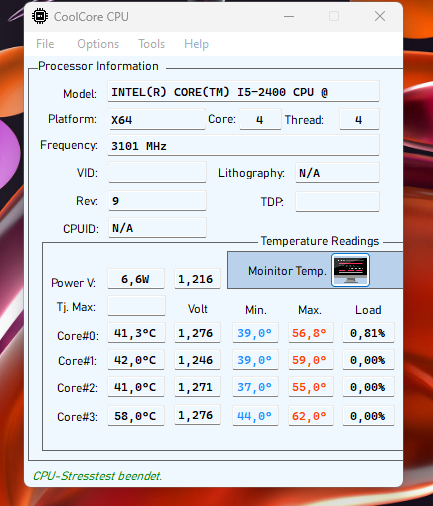
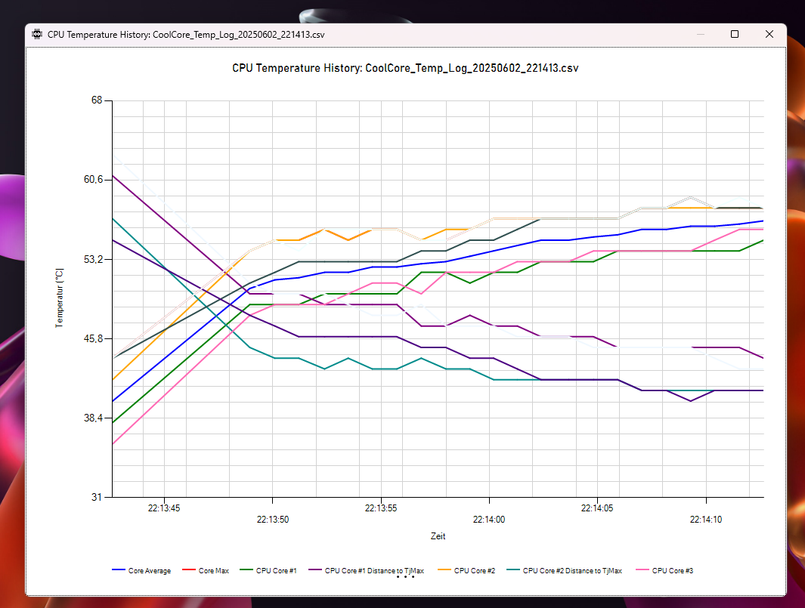
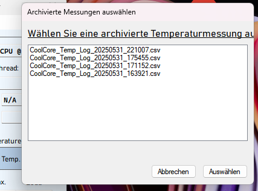
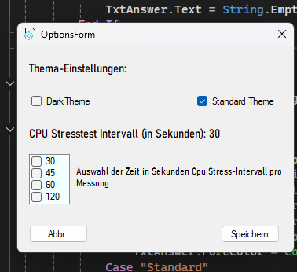

# CoolCore CPU ✨

## Halten Sie Ihre Kerne cool und Ihre Leistung im Blick.

[](https://docs.microsoft.com/en-us/dotnet/visual-basic/)

---

### 🖥️ Überblick

**CoolCore CPU** ist eine spezialisierte Windows-Anwendung, die entwickelt wurde, um die Temperatur und Auslastung Ihrer CPU-Kerne in Echtzeit zu überwachen. Sie bietet detaillierte Einblicke in die Leistungsdaten Ihrer Prozessorkerne und ermöglicht es Ihnen, Temperaturverläufe über die Zeit zu verfolgen und zu analysieren. Perfekt für Gamer, Overclocker oder jeden, der die Gesundheit seiner CPU im Auge behalten möchte.

---

### 🚀 Hauptfunktionen

* **Echtzeit-Monitoring:** 🌡️ Überwachung der individuellen CPU-Kerntemperaturen und -Auslastung in Echtzeit.
* **Historische Daten:** 💾 Speicherung und Archivierung von Temperaturmessungen als CSV-Dateien für langfristige Trends und Leistungsmuster.
* **Interaktive Diagramme:** 📊 Visualisierung von Temperaturdaten über die Zeit für jeden Kern in einem übersichtlichen Liniendiagramm, inklusive detaillierter Tooltips.
* **Archivverwaltung:** 📂 Komfortables Laden und Anzeigen archivierter Messungen über einen dedizierten Dateiauswahldialog.
* **Benutzerfreundlichkeit:** 👍 Intuitive und klare Oberfläche zur einfachen Bedienung und Datenverwaltung.

---

### 📸 Screenshots
+ MAIN WINDOW


+MONITOR TEMP / STRESS CPU


+ CHART SCREEN


+ ARCHIVE BOX
  

+ SETTINGS DIALOG
  


➡️ Erste Schritte
Um CoolCore CPU zu nutzen, klonen Sie dieses Repository und kompilieren Sie das Projekt in Visual Studio.
```markdown
git clone [https://github.com/trOw41/CoolCore-CPU.git](https://github.com/trOw41/CoolCore-CPU.git)
cd CoolCore-CPU
```
+ Öffnen Sie die .sln-Datei in Visual Studio und erstellen Sie das Projekt.

Voraussetzungen:

Visual Studio (z.B. Visual Studio 2019 oder neuer)
.NET Framework (Zielversion, z.B. 4.7.2 oder 4.8)
Stellen Sie sicher, dass die benötigten NuGet-Pakete (z.B. OpenHardwareMonitorLib) installiert sind.
💻 Verwendung
Anwendung starten: Nach dem Kompilieren finden Sie die ausführbare Datei im bin/Debug oder bin/Release-Ordner.
Monitoring starten: Klicken Sie auf den Button "Monitoring Starten", um die Echtzeit-Temperaturüberwachung zu beginnen.
Messungen archivieren: Nach Beendigung des Monitorings werden die Daten automatisch als CSV-Datei im Ordner TemperatureLogs im Programmverzeichnis abgelegt.
Archivierte Messungen laden: Über das "Tools" Menü (oder ein ähnliches Menü) können Sie "Archivierte Messungen laden" auswählen, um eine Liste der gespeicherten CSV-Dateien anzuzeigen und eine zur Analyse auszuwählen.
🤝 Mitwirken
Dieses Projekt ist unter  lizenziert. Wenn Sie zur Entwicklung beitragen möchten, sind Pull Requests herzlich willkommen!

⚖️ Lizenz / Copyright
© 2025 Daniel Trojan. Alle Rechte vorbehalten.
