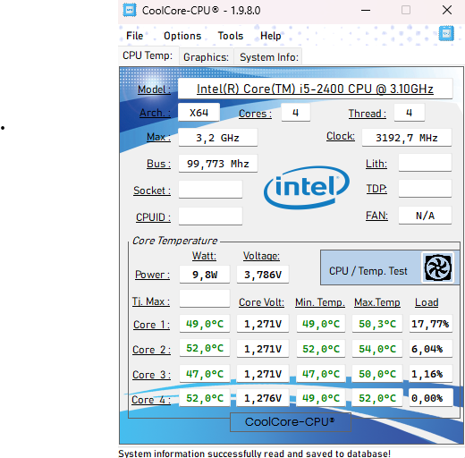
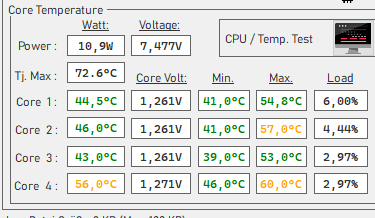
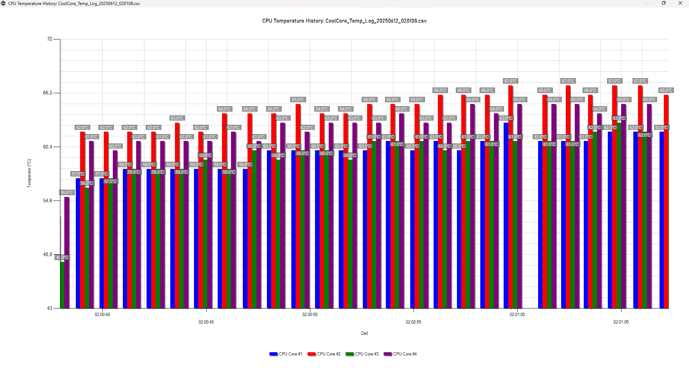
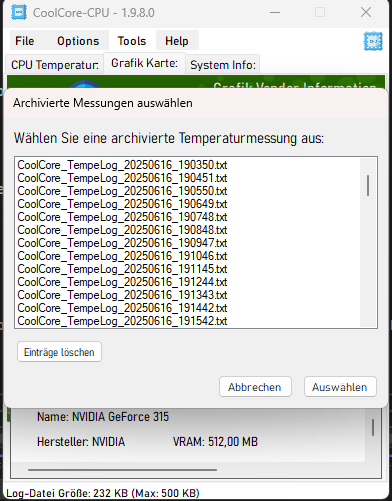
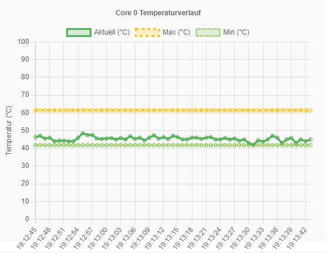

# CoolCore-CPU® ✨

## Halten Sie Ihre Kerne cool und Ihre Leistung im Blick.

[](https://docs.microsoft.com/en-us/dotnet/visual-basic/)

---

### 🖥️ Überblick

**CoolCore-CPU®** ist eine spezialisierte Windows-Anwendung, die entwickelt wurde, um die Temperatur und Auslastung Ihrer CPU-Kerne in Echtzeit zu überwachen. Sie bietet detaillierte Einblicke in die Leistungsdaten Ihrer Prozessorkerne und ermöglicht es Ihnen, Temperaturverläufe über die Zeit zu verfolgen und zu analysieren. Perfekt für Gamer, Overclocker oder jeden, der die Gesundheit seiner CPU im Auge behalten möchte.

---

### 🚀 Hauptfunktionen

* **Echtzeit-Monitoring:** 🌡️ Überwachung der individuellen CPU-Kerntemperaturen und -Auslastung in Echtzeit.
* **Detaillierte Statistiken:** 📈 Anzeige von Durchschnitts- und Maximalwerten für Temperatur und Auslastung jedes Kerns.
* **Online-Datenbank:** 🌐 Anbindung an eine Online-Datenbank, um die passenden Prozessor Informationen abzurufen (zur Zeit sind nur INTEL/AMD durch die Datenbank unterstützt! CoolCore-CPU® läuft aber auch auf generichen CPU´s mit dem entsprechend weniger informatonen z.b Lithography TDP etc).
* **Historische Daten:** 💾 Speicherung und Archivierung von Temperaturmessungen als CSV-Dateien für langfristige Trends und Leistungsmuster.
* **Interaktive Diagramme:** 📊 Visualisierung von Temperaturdaten über die Zeit für jeden Kern in einem übersichtlichen Liniendiagramm, inklusive detaillierter Tooltips.
* **Archivverwaltung:** 📂 Komfortables Laden und Anzeigen archivierter Messungen über einen dedizierten Dateiauswahldialog.
* **Benutzerfreundlichkeit:** 👍 Intuitive und klare Oberfläche zur einfachen Bedienung und Datenverwaltung.

---

### 📦 Installation und Nutzung
**CoolCore-CPU®** ist einfach zu installieren und zu verwenden. Es erfordert keine speziellen Hardwarevoraussetzungen und kann auf den meisten Windows-Systemen ausgeführt werden. Die Anwendung ist in Visual Basic .NET geschrieben und nutzt die OpenHardwareMonitorLib für die Hardwareüberwachung.
### 🔧 Technische Details
* **Programmiersprache:** Visual Basic .NET
* **Framework:** .NET Framework 4.7.2 oder höher
* **Bibliotheken:** OpenHardwareMonitorLib für Hardwareüberwachung
* **Datenformate:** CSV, HTML5, JavaScript, MySQL und CSS für die Archivierung und Darstellung von Temperaturmessungen und erhebeungen der Prozessor Daten.
* **Datenbank:** Anbindung an eine Online-Datenbank für Prozessorinformationen (derzeit nur INTEL/AMD unterstützt)
* **Lizenz:** EULA-Lizenz (siehe LICENSE.txt für Details)

* **Entwickler:** Daniel Trojan (trOw41)

### 📜 Dokumentation
Die Dokumentation für **CoolCore-CPU®** ist Online unter [CoolCore-CPU Documentation](https://www.cool-core.de.cool/faq.html)]

### 📥 Download
Die neueste Version von **CoolCore-CPU®** kann von der offiziellen Website heruntergeladen werden: [CoolCore-CPU Download](https://www.cool-core.de.cool/downloads.html)

### 📜 Support
Für Unterstützung und Fragen zur Anwendung besuchen Sie bitte die [CoolCore-CPU Support-Seite](https://www.cool-core.de.cool/support.html) oder kontaktieren Sie den Entwickler direkt über die E-Mail-Adresse: sulomusic@protonmail.com


### 📸 Screenshots
+ MAIN WINDOW


+MONITOR TEMP


+ CHART SCREEN


+ ARCHIVE BOX
  

+ TEMPERATUR LOG
  


➡️ Erste Schritte
Um CoolCore CPU zu nutzen, klonen Sie dieses Repository und kompilieren Sie das Projekt in Visual Studio.
```markdown
git clone [https://github.com/trOw41/CoolCore-CPU.git](https://github.com/trOw41/CoolCore-CPU.git)
cd CoolCore-CPU
```
+ Öffnen Sie die .sln-Datei in Visual Studio und erstellen Sie das Projekt.

Voraussetzungen:

Visual Studio (z.B. Visual Studio 2019 oder neuer)
.NET Framework (Zielversion, z.B. 4.7.2 oder 4.8)
Stellen Sie sicher, dass die benötigten NuGet-Pakete (z.B. OpenHardwareMonitorLib) installiert sind.
💻 Verwendung
Anwendung starten: Nach dem Kompilieren finden Sie die ausführbare Datei im bin/Debug oder bin/Release-Ordner.
Monitoring starten: Klicken Sie auf den Button "Monitoring Starten", um die Echtzeit-Temperaturüberwachung zu beginnen.
Messungen archivieren: Nach Beendigung des Monitorings werden die Daten automatisch als CSV-Datei im Ordner TemperatureLogs im Programmverzeichnis abgelegt.
Archivierte Messungen laden: Über das "Tools" Menü (oder ein ähnliches Menü) können Sie "Archivierte Messungen laden" auswählen, um eine Liste der gespeicherten CSV-Dateien anzuzeigen und eine zur Analyse auszuwählen.
🤝 Mitwirken
Dieses Projekt ist unter  lizenziert. Wenn Sie zur Entwicklung beitragen möchten, sind Pull Requests herzlich willkommen!

⚖️ Lizenz / Copyright
© 2025 Daniel Trojan. Alle Rechte vorbehalten.
